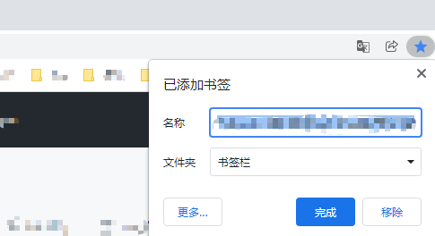
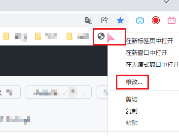
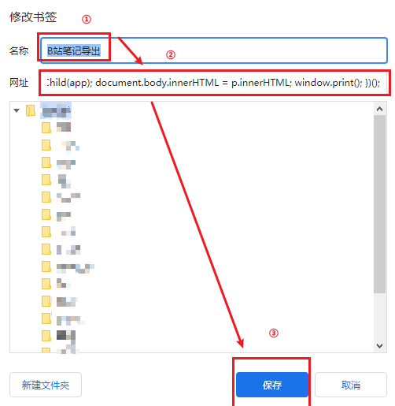
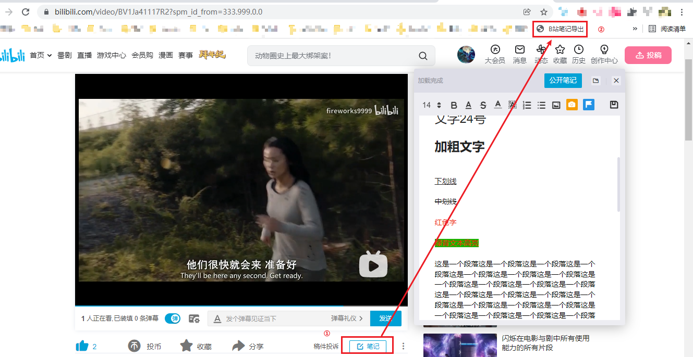
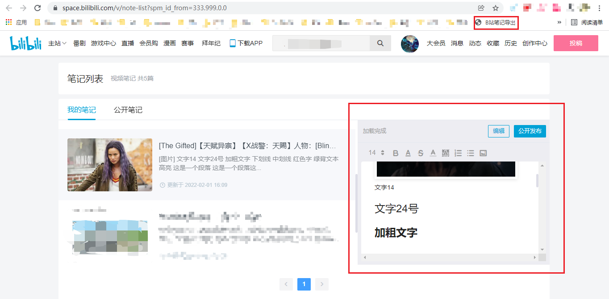
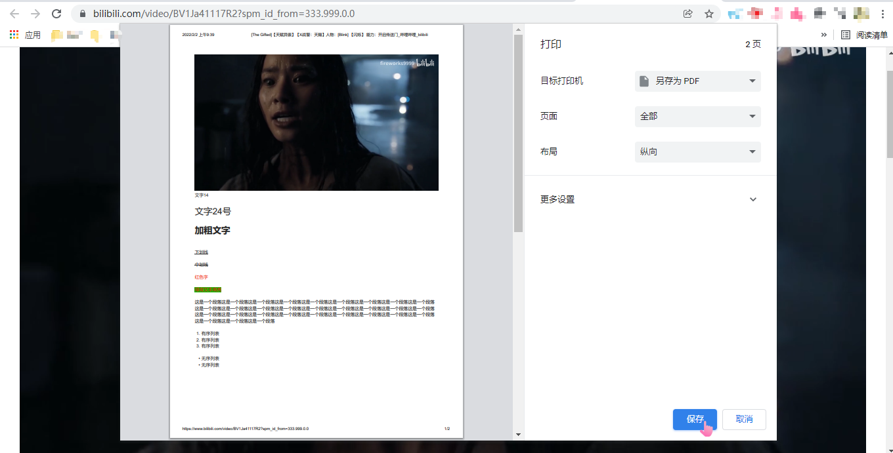

# bilibiliNoteExport
B站（哔哩哔哩视频网站）视频笔记一键导出（pdf）

## 方法一（利用收藏的书签在地址栏注入JS）：

1. 打开`easyBNoteExport/urlScript.js`文件，复制里面的代码。

2. 收藏任意网页到书签栏，如图所示：

   

3. 右键点击刚刚收藏的书签，并点击修改，如图所示：

   

4. 修改“名称”，在“网址”栏粘贴刚刚复制的代码，并保存，如图所示：

   

5. 打开有笔记的页面（以下两处皆可，但要保证笔记页显示出来），点击书签栏的“B站笔记导出”，如图所示：

   

   

6. 页面自动弹出打印选项，选择打印pdf，等预览页面全部图片加载完后点击保存即可，如图所示：

   

7.  ** 注意：一定要等到所有图片加载完毕再保存，否则保存的pdf中图片不完整。 ** 如果预览页面的后部分图片迟迟未加载出来，点击取消，将页面拖到最低端，等图片加载完，右键点击下方空白处，选择“打印”。

## 方法二（利用Chrome Extension注入JS）：

1. 下载`lightBNoteExport`文件夹，将其视为Chrome扩展程序加载到Chrome浏览器中。
2. 后续操作等同于方法一中的5、6、7。
